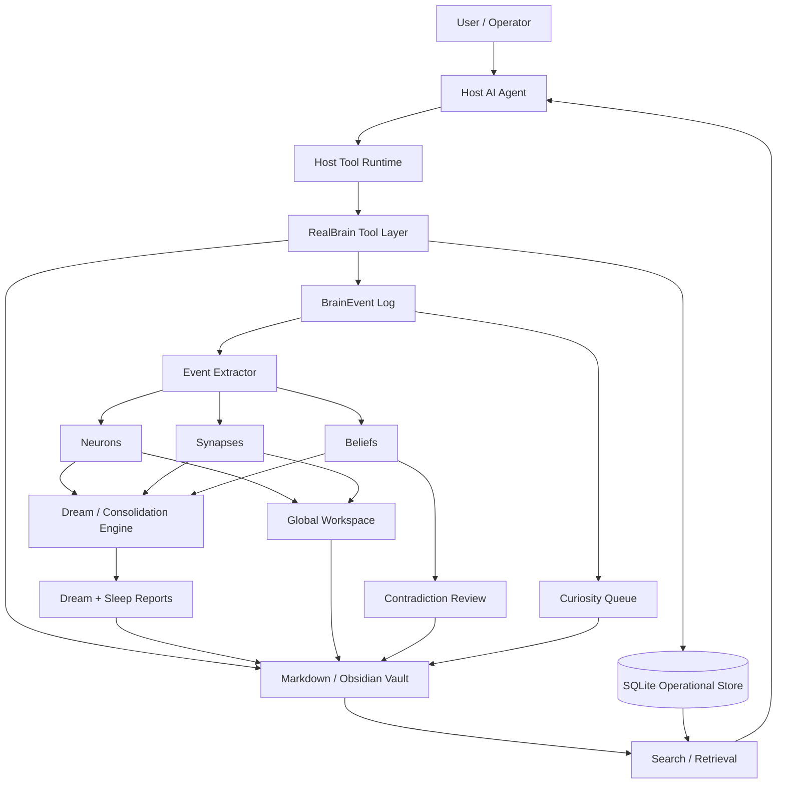
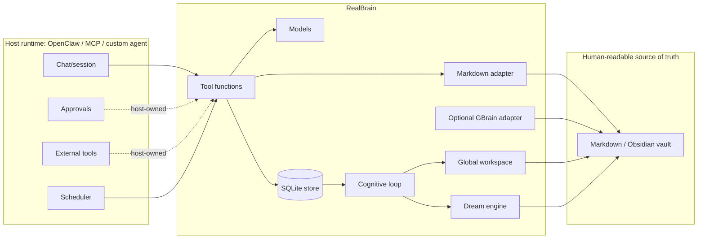
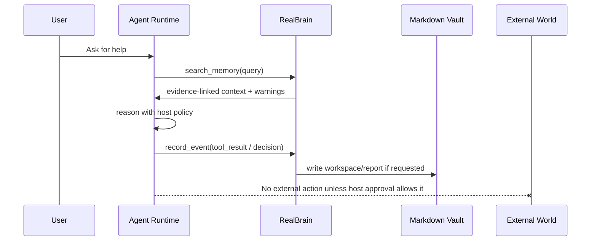
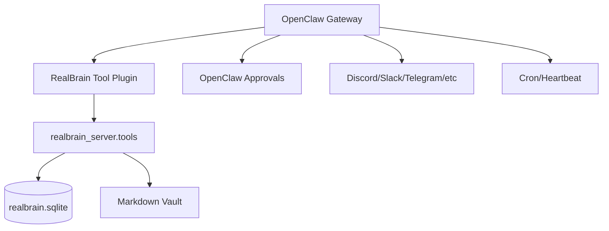
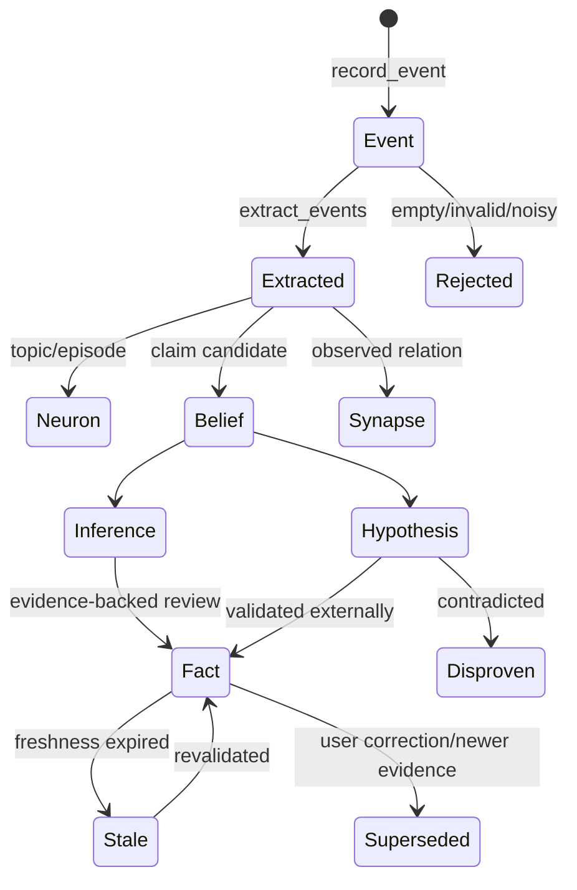

# RealBrain

[](https://github.com/qorexdevs/realbrain/actions/workflows/ci.yml) [](pyproject.toml) [](LICENSE) [](docs/SECURITY_AND_PRIVACY.md)

> Local operating-memory layer for AI agents: events, evidence-linked graph memory, beliefs, global workspace, dream/consolidation loops, and safe markdown/Obsidian integration.

RealBrain is a small, local-first memory/control-plane toolkit for agent runtimes such as **OpenClaw**, MCP-compatible assistants, custom FastAPI bridges, CLI agents, or internal multi-agent systems.

It is designed for people who want their agents to remember useful things **without turning every chat transcript into untrusted memory slop**.

RealBrain is **not consciousness**, **not autonomous authority**, and **not a replacement for your source-of-truth knowledge base**. It is an engineering layer that records events, builds evidence-linked memory structures, surfaces active context, and proposes consolidation while keeping durable truth human-readable and auditable.

---

## Start here

```bash
git clone https://github.com/ericfly02/realbrain.git
cd realbrain
python3 -m venv .venv
source .venv/bin/activate
pip install -e .
python -m unittest discover -s tests
python examples/demo.py
```

Then expose `realbrain_server.tools` from your host runtime, MCP server, or OpenClaw plugin. See [docs/LAUNCH_PLAYBOOK.md](docs/LAUNCH_PLAYBOOK.md), [docs/ROADMAP.md](docs/ROADMAP.md), and [docs/ARCHITECTURE.md](docs/ARCHITECTURE.md).

## Best first use cases

- Give an OpenClaw assistant evidence-linked project memory without storing every raw chat.
- Wrap the tool layer in an MCP server for local desktop assistants.
- Keep an Obsidian/markdown vault human-readable while SQLite acts as an operational index.
- Run bounded dream/consolidation passes that produce review queues, not autonomous actions.

## What it is not

RealBrain is not an AGI brain, consciousness claim, hosted SaaS memory service, vector database replacement, permission system, or external-action automation engine. Host runtimes still own identity, approvals, secrets, networking, and high-impact actions.

## Contribute

RealBrain is early and intentionally small. Good first contributions include docs fixes, adapter examples, MCP/OpenClaw wrappers, benchmark fixtures, demo screenshots/GIFs, packaging polish, and safety tests. Start with [CONTRIBUTING.md](CONTRIBUTING.md), browse [starter issues](https://github.com/ericfly02/realbrain/issues?q=is%3Aissue%20is%3Aopen%20label%3Agood-first-issue), or open a [GitHub Discussion](https://github.com/ericfly02/realbrain/discussions) with integration ideas. Maintainers can use [docs/COMMUNITY_OUTREACH.md](docs/COMMUNITY_OUTREACH.md), [docs/LAUNCH_POSTING_QUEUE.md](docs/LAUNCH_POSTING_QUEUE.md), and [docs/BLOG_POST_AGENT_MEMORY.md](docs/BLOG_POST_AGENT_MEMORY.md) for an ethical launch cadence.

---

## What we are building

RealBrain is a **local memory substrate for AI agents**. It gives an agent a structured place to record important events, connect them into an evidence-linked graph, surface active context, and run safe consolidation loops.

In plain terms: we are building the missing "operating memory" layer between a stateless chatbot and a messy personal knowledge base.

RealBrain is meant to be embedded into runtimes like OpenClaw, MCP servers, CLI agents, or custom assistant backends. The host runtime keeps control over tools, permissions, users, and external actions. RealBrain focuses on memory quality.

## What problem this solves

Modern agents usually fail at durable memory in one of two ways:

1. **They forget everything.** Each new session starts cold, so users repeat decisions, project context, preferences, and constraints.
2. **They remember too much, badly.** Raw transcripts and generated guesses get treated like truth, which creates stale context, privacy risk, hallucinated "facts", and low-trust retrieval.

RealBrain solves this by making memory explicit, typed, and reviewable:

- important interactions become `BrainEvent` records with evidence refs;
- durable concepts, projects, decisions, claims, people, tools, and questions become `Neuron` nodes;
- relationships become typed `Synapse` edges;
- claims are tracked as `fact`, `inference`, `hypothesis`, `stale`, or `disproven`;
- current context is surfaced through a `GlobalWorkspace`;
- dream/consolidation loops propose hypotheses and review queues without promoting them to facts;
- markdown write-back keeps the human-readable vault as the source of truth.

The goal is not to make agents "conscious." The goal is to make agent memory **auditable, local-first, evidence-backed, and safe enough to use in real workflows**.

## Who this is for

RealBrain is for builders who want agents that can:

- remember durable user/project context without storing every raw chat forever;
- retrieve decisions with evidence instead of vibes;
- separate facts from hypotheses and stale claims;
- maintain a markdown/Obsidian-compatible knowledge base;
- run nightly memory hygiene and contradiction review;
- integrate memory into OpenClaw, MCP, or custom multi-agent systems.

---

## For LLM coding agents: read this first

If a user asks you to install or implement this repo, follow this exact interpretation:

1. **RealBrain stores operational memory.** It does not replace the user's notes, database, CRM, calendar, broker, or health system.
2. **Markdown/Obsidian remains the recommended source of truth.** SQLite is an operational index and graph store.
3. **Dreams and generated hypotheses are never facts.** They must remain marked as hypotheses until validated with evidence.
4. **External/high-impact actions stay owned by the host runtime.** RealBrain must not send messages, trade, modify calendars, delete files, make purchases, or give medical authority.
5. **Every durable claim should have evidence refs, confidence, freshness, and status.** If evidence is missing, store it as a question/hypothesis, not a fact.
6. **Start with local files and SQLite.** Do not add cloud services unless the user explicitly asks.
7. **Do not ingest secrets.** Never store API keys, tokens, passwords, private keys, or raw sensitive dumps in RealBrain memory.

Minimal implementation target for an agent:

```text
pip install -e .
python examples/demo.py
python -m unittest discover -s tests
```

Then expose the functions in `realbrain_server/tools.py` through the host agent runtime.

---

## Why RealBrain exists

Most agents have two bad memory modes:

- **Stateless mode:** every session starts over; the user repeats context forever.
- **Slop mode:** everything is remembered; stale claims, draft ideas, hallucinations, and private data pollute future answers.

RealBrain tries to create a middle path:

- Record events as evidence.
- Extract candidate neurons/synapses/beliefs conservatively.
- Keep claims marked as fact/inference/hypothesis/stale/disproven.
- Surface active context through a global workspace.
- Run dream/consolidation loops as suggestion-only hygiene.
- Write human-readable reports and queues into a markdown vault.
- Let the host runtime decide permissions and approvals.

---

## Core concept graph



---

## Architecture at a glance



### Important boundary

RealBrain can remember and suggest. The host runtime decides whether to act.



---

## Repository layout

```text
realbrain-public/
  README.md                         # this file: LLM-optimized implementation guide
  pyproject.toml                    # package metadata
  LICENSE                           # MIT
  .gitignore

  realbrain/                        # core library
    __init__.py
    models.py                       # Pydantic schemas
    store.py                        # SQLite operational event/graph store
    obsidian_adapter.py             # safe markdown vault read/write/search
    gbrain_adapter.py               # optional GBrain wrapper + markdown fallback
    global_workspace.py             # active attention board
    dream_engine.py                 # bounded hypothesis/consolidation reports
    cognitive_loop.py               # extraction, hygiene, contradictions, curiosity, nightly consolidation

  realbrain_server/
    __init__.py
    tools.py                        # host-agent tool functions around the core library

  examples/
    demo.py                         # end-to-end local demo
    openclaw_tool_bridge_example.py # how to wrap tools in OpenClaw/custom bridge

  tests/
    test_models_store.py
    test_adapters.py
    test_cognitive_loop.py
    test_dream_workspace.py

  docs/
    ARCHITECTURE.md
    LLM_IMPLEMENTATION_GUIDE.md
    SECURITY_AND_PRIVACY.md
```

---

## Data model

### BrainEvent

Raw observation or internal event.

Examples:

- conversation
- tool_result
- markdown_edit
- repo_event
- web_research
- user_feedback
- contradiction
- dream
- decision

Key fields:

- `event_type`
- `source`
- `content`
- `metadata`
- `sensitivity`
- `evidence_refs`
- `processed_status`

### Neuron

Atomic memory node.

Types include:

- concept
- person
- company
- project
- goal
- decision
- claim
- episode
- skill
- source
- question
- hypothesis
- procedure
- metric
- agent
- tool

Key fields:

- `title`
- `summary`
- `canonical_path`
- `confidence`
- `importance`
- `evidence_refs`
- `tags`

### Synapse

Typed edge between neurons.

Relation types include:

- supports
- contradicts
- caused_by
- part_of
- related_to
- depends_on
- similar_to
- learned_from
- used_for
- blocks
- enables
- owned_by
- observed_with
- predicts
- next_step

Key fields:

- `source_neuron_id`
- `target_neuron_id`
- `relation_type`
- `weight`
- `confidence`
- `evidence_refs`
- `status`

### Belief

Claim wrapper separate from raw text.

Statuses:

- fact
- inference
- hypothesis
- disproven
- stale

A belief should only become `fact` when supported by evidence and appropriate review.

### DreamRun

Offline cognition record.

Modes:

- nrem_consolidation
- rem_generation
- future_simulation
- contradiction_scan
- idea_synthesis

Dream outputs are suggestions/hypotheses. They cannot promote truth or execute actions by themselves.

### GlobalWorkspaceItem

Current active attention item.

Used to tell the agent: “these are the currently relevant memories/synapses/questions.”

---

## Installation

### Requirements

- Python 3.10+
- SQLite, included with Python
- `pydantic>=2.0`
- optional: GBrain CLI if you want semantic/graph retrieval integration
- optional: Obsidian or any markdown folder as the human-readable vault

### Local development install

```bash
git clone https://github.com/ericfly02/realbrain.git
cd realbrain
python3 -m venv .venv
source .venv/bin/activate
pip install -e '.[dev]'
python -m unittest discover -s tests
python examples/demo.py
```

If you do not use a virtual environment:

```bash
pip install -e '.[dev]'
python -m unittest discover -s tests
```

### Minimal library install

```bash
pip install -e .
```

### Environment variables

RealBrain has safe local defaults. You can configure paths explicitly:

```bash
export REALBRAIN_ROOT="$HOME/realbrain-vault"
export REALBRAIN_DB="$HOME/realbrain-vault/ops/brain/realbrain.sqlite"
```

Optional GBrain integration:

```bash
export GBRAIN_BINARY="$HOME/.bun/bin/gbrain"
export GBRAIN_WORKDIR="$HOME/tools/gbrain"
export GBRAIN_HOME="$HOME"
export BUN_BINARY="$HOME/.bun/bin/bun"
```

Do not put secrets in these variables. RealBrain does not need API keys for its core local mode.

---

## Quickstart: core library

```python
from pathlib import Path

from realbrain.models import BrainEvent, Neuron, Synapse
from realbrain.store import RealBrainStore

store = RealBrainStore(Path("./realbrain_vault/ops/brain/realbrain.sqlite"))

event = store.record_event(BrainEvent(
    event_type="conversation",
    source="demo",
    content="The user wants evidence-backed memory, not transcript slop.",
    sensitivity="personal",
    evidence_refs=["demo://conversation/1"],
))

memory = store.add_neuron(Neuron(
    type="concept",
    title="Evidence-backed memory",
    summary="Memory claims should link back to source evidence.",
    confidence=0.8,
    importance=8,
    evidence_refs=[event.id],
))

print(store.find_neurons(query="evidence memory"))
```

---

## Quickstart: tool layer

```python
from realbrain_server.tools import RealBrainToolContext, record_event, search_memory, activate, dream

ctx = RealBrainToolContext(
    brain_root="./realbrain_vault",
    db_path="./realbrain_vault/ops/brain/realbrain.sqlite",
)

record_event({
    "event_type": "conversation",
    "source": "my-agent",
    "content": "RealBrain should remember durable facts with evidence refs.",
    "sensitivity": "personal",
    "evidence_refs": ["chat://123"],
}, ctx=ctx)

print(search_memory("durable facts evidence", ctx=ctx))
print(activate("RealBrain", ctx=ctx))
print(dream(mode="rem_generation", budget=3, focus_area="RealBrain", ctx=ctx))
```

---

## Installing with OpenClaw

RealBrain is not tied to OpenClaw, but OpenClaw is a natural host because it already handles chat, tools, scheduling, approvals, subagents, and external integrations.

### Recommended OpenClaw integration pattern



OpenClaw should own:

- user identity and sessions
- channel routing
- external tool permissions
- approvals
- high-impact action boundaries
- scheduling
- secrets

RealBrain should own:

- operational memory records
- graph/search records
- workspace reports
- contradiction/curiosity queues
- dream/consolidation suggestions

### Tool mapping

Map host tools to functions in `realbrain_server/tools.py`:

| Host tool name | RealBrain function | Safe default authority |
|---|---|---|
| `realbrain_record_event` | `record_event` | write operational event only |
| `realbrain_search_memory` | `search_memory` | read/search |
| `realbrain_add_neuron` | `add_neuron` | graph write only |
| `realbrain_add_synapse` | `add_synapse` | graph write only |
| `realbrain_activate` | `activate` | writes workspace report |
| `realbrain_get_workspace` | `get_global_workspace` | read workspace |
| `realbrain_dream` | `dream` | writes hypothesis report |
| `realbrain_extract_events` | `extract_events` | inference-level extraction |
| `realbrain_synapse_hygiene` | `synapse_hygiene` | graph weight/status only |
| `realbrain_review_contradictions` | `review_contradictions` | writes review queue |
| `realbrain_curiosity_queue` | `curiosity_queue` | writes question queue |
| `realbrain_nightly_consolidation` | `nightly_consolidation` | internal memory hygiene |

### OpenClaw implementation prompt

Use this prompt when asking an agent to wire RealBrain into OpenClaw:

```text
Implement RealBrain as a local OpenClaw tool plugin.

Constraints:
- Do not store secrets in RealBrain.
- Do not let RealBrain bypass OpenClaw approvals.
- Use REALBRAIN_ROOT and REALBRAIN_DB for paths.
- Expose only the functions in realbrain_server.tools.
- Treat dream/consolidation output as hypothesis/suggestion only.
- Keep external actions owned by OpenClaw, not RealBrain.
- Add smoke tests: record event, search memory, activate workspace, run dream.

Files to inspect first:
- README.md
- realbrain_server/tools.py
- realbrain/models.py
- realbrain/store.py
- realbrain/obsidian_adapter.py
- examples/openclaw_tool_bridge_example.py
```

---

## Installing with MCP-compatible clients

This repository does not force a specific MCP SDK because MCP host ecosystems vary. The recommended pattern is:

1. Create a small MCP server wrapper.
2. Instantiate `RealBrainToolContext` once.
3. Register each function in `realbrain_server.tools` as an MCP tool.
4. Keep the MCP server local by default.
5. Require host approval for any downstream external action.

Pseudo-code:

```python
from realbrain_server.tools import RealBrainToolContext, record_event, search_memory, activate

ctx = RealBrainToolContext(brain_root="./vault")

@mcp.tool()
def realbrain_record_event(event: dict) -> dict:
    return record_event(event, ctx=ctx)

@mcp.tool()
def realbrain_search_memory(query: str, filters: dict | None = None) -> dict:
    return search_memory(query, filters, ctx=ctx)

@mcp.tool()
def realbrain_activate(node_or_query: str, depth: int = 1, budget: int = 5) -> dict:
    return activate(node_or_query, depth=depth, budget=budget, ctx=ctx)
```

---

## Safety model

### RealBrain may

- record events
- search operational memory and markdown
- create evidence-linked neurons/synapses
- create inference-level beliefs
- write markdown reports/queues/workspace pages inside the configured vault
- run bounded dream/consolidation passes
- surface contradictions and questions

### RealBrain may not

- send external messages
- trade or move money
- modify calendars
- delete arbitrary files
- make purchases
- claim medical authority
- store secrets
- convert hypotheses into facts automatically
- bypass host approvals

### Host runtime responsibilities

Your host agent/runtime must enforce:

- authentication
- user identity
- external permissions
- high-impact approvals
- secret handling
- rate limits
- channel delivery
- audit logs for real-world actions

---

## Memory lifecycle



---

## Suggested vault layout

RealBrain writes inside the configured `REALBRAIN_ROOT`.

```text
REALBRAIN_ROOT/
  brain/
    global-workspace/
      current.md
    curiosity/
      current.md
    dreams/
      YYYY-MM-DD.md
    sleep-reports/
      YYYY-MM-DD.md
      nightly-consolidation-YYYY-MM-DD.md
    reviews/
      contradictions/
        YYYY-MM-DD.md
  ops/
    brain/
      realbrain.sqlite
```

You can point `REALBRAIN_ROOT` at an Obsidian vault or any markdown folder.

---

## Common recipes

### 1. Record an important interaction

```python
record_event({
    "event_type": "conversation",
    "source": "discord:channel/example",
    "content": "User decided to keep the memory layer local-first.",
    "sensitivity": "personal",
    "evidence_refs": ["discord://message/123"],
})
```

### 2. Extract candidate memory

```python
extract_events(limit=20, dry_run=False)
```

This creates episode/topic neurons, observed_with synapses, and inference-level beliefs. It does not create facts automatically.

### 3. Activate workspace before answering

```python
activate("current project", depth=1, budget=5)
get_global_workspace()
```

Use this to surface active context for an agent.

### 4. Run a bounded dream

```python
dream(mode="rem_generation", budget=5, focus_area="product strategy")
```

Dream output is written to markdown and marked as hypothesis/suggestion only.

### 5. Run nightly consolidation

```python
nightly_consolidation(budget=20, focus_area="current project")
```

This bundles extraction, synapse hygiene, contradiction review, curiosity queue, and NREM report.

---

## What to publish publicly

Safe to publish:

- this code
- schemas
- generic architecture docs
- tests
- examples with fake data
- generic OpenClaw/MCP wrapper examples

Do not publish:

- personal vault contents
- real SQLite memory DBs
- API keys or `.env`
- private decisions/notes
- user-specific integrations
- production host config
- private prompts/personas unless intentionally open-sourced

---

## Roadmap

### v0.1

- Core schemas
- SQLite store
- Markdown adapter
- Optional GBrain adapter
- Tool wrapper functions
- Global workspace
- Dream engine
- Extraction/hygiene/curiosity/contradiction loops
- Tests and examples

### v0.2

- First-class MCP server package
- OpenClaw plugin package
- CLI: `realbrain record/search/activate/dream/consolidate`
- JSON schema exports for all tools
- More robust search/reranking adapters

### v0.3

- Pluggable extractors
- Local embedding option
- Evidence-span support
- Belief explanation API
- Rebuild SQLite from markdown/events
- Policy engine for write authority

---

## Naming and positioning

Recommended public tagline:

> RealBrain is a local operating-memory layer for AI agents: evidence-linked graph memory, global workspace, and safe consolidation without autonomous authority.

Avoid saying:

- “sentient”
- “conscious”
- “AGI brain”
- “autonomous decision-maker”
- “stores all your secrets”

Say instead:

- local-first
- evidence-linked
- human-readable source of truth
- operational memory
- suggestion-only dreams
- host-owned approvals
- auditable graph memory

---

## Development checks

Before opening a pull request, run:

```bash
python -m unittest discover -s tests
python -m compileall realbrain realbrain_server examples tests
python examples/demo.py
grep -RInE 'api[_-]?key|secret|token|password|BEGIN (RSA|OPENSSH|PRIVATE)|/home/|\.openclaw|spesion|SPESION|NEXUS|Eric' . \
  --exclude-dir=.git --exclude-dir=__pycache__ --exclude='*.pyc'
```

Expected: tests pass, compile succeeds, the demo runs with fake local data, and scans show no committed secrets or personal vault data.

## License

MIT. See `LICENSE`.
