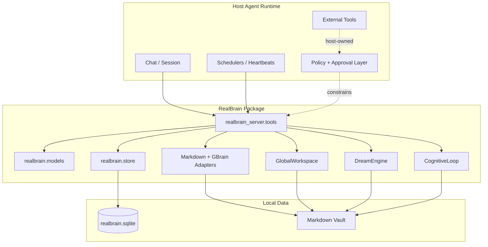
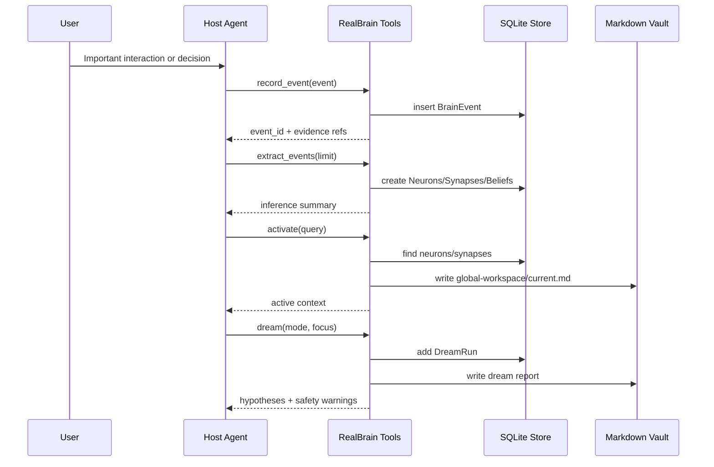
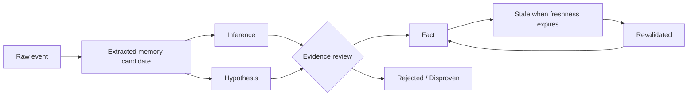

# RealBrain Architecture

RealBrain is a local operating-memory layer for AI agents.

It combines:

- an append-only-ish event log (`BrainEvent`)
- typed memory nodes (`Neuron`)
- typed graph edges (`Synapse`)
- claim tracking (`Belief`)
- active attention (`GlobalWorkspace`)
- bounded hypothesis generation (`DreamEngine`)
- markdown/Obsidian-compatible write-back
- optional GBrain retrieval integration

RealBrain is not a runtime, not an autonomous actor, and not a source-of-truth replacement. It is a memory substrate that host runtimes can expose as tools.

---

## Design goals

1. **Local-first**: core functionality works with Python, SQLite, and markdown files.
2. **Evidence-linked**: durable records should point to source events or external refs.
3. **Trust-aware**: facts, inferences, and hypotheses are different statuses.
4. **Human-readable**: summaries, reviews, curiosity queues, and dream outputs are markdown.
5. **Host-controlled authority**: the surrounding agent runtime owns approvals and external actions.
6. **LLM-friendly implementation surface**: small modules, explicit tool wrappers, conservative examples.

---

## System boundary

RealBrain should never be the component that decides whether to perform a high-impact external action. It can store context and recommendations; the host runtime must enforce authority.

---

## Module responsibilities

### `realbrain/models.py`

Pydantic schemas and validation rules.

Important properties:

- confidence/importance/weight are bounded
- self-edge synapses are rejected
- enum-like fields constrain memory status and relation types
- default IDs are generated locally

### `realbrain/store.py`

SQLite persistence layer.

Stores:

- `brain_events`
- `neurons`
- `synapses`
- `beliefs`
- `dream_runs`
- `global_workspace`

The store is an operational index. Durable canonical truth should still live in human-readable markdown or another trusted system.

### `realbrain/obsidian_adapter.py`

Safe markdown vault adapter.

Capabilities:

- resolve paths under a configured root
- reject path traversal
- read/write markdown
- append evidence refs
- simple text search fallback
- upsert sections
- resolve canonical title/path heuristics

Despite the name, it works with any markdown folder, not only Obsidian.

### `realbrain/gbrain_adapter.py`

Optional GBrain wrapper.

Capabilities:

- run GBrain search if a binary/workdir is configured
- fall back to markdown search
- resolve canonical paths
- return warnings instead of hard failing when GBrain is unavailable

### `realbrain/global_workspace.py`

Active attention layer.

Given a node/query, it:

- finds matching neurons
- pulls related synapses
- writes `brain/global-workspace/current.md`
- stores workspace items in SQLite
- returns activated context to the host agent

### `realbrain/dream_engine.py`

Bounded offline hypothesis generation.

Modes:

- `nrem_consolidation`
- `rem_generation`
- `future_simulation`
- `contradiction_scan`
- `idea_synthesis`

Safety invariant:

- dreams produce hypotheses/suggestions only
- dreams do not promote facts
- dreams do not call tools
- dreams do not execute external actions

### `realbrain/cognitive_loop.py`

Memory hygiene and review loops.

Components:

- `EventExtractor`: creates conservative evidence-linked memory candidates from events
- `SynapseHygiene`: decays stale/weak graph edges
- `ContradictionReview`: writes contradiction review queues
- `CuriosityQueue`: writes question queues
- `NightlyConsolidator`: runs bounded extraction/hygiene/review/report flow

### `realbrain_server/tools.py`

Host integration layer.

This is the recommended file for OpenClaw/MCP/custom bridges to wrap.
It exposes high-level functions with structured responses and warnings.

---

## Data flow

---

## Trust model

Recommended policy:

- `BrainEvent` = observed input, not automatically true
- `Belief(status="hypothesis")` = generated idea requiring validation
- `Belief(status="inference")` = plausible extracted claim
- `Belief(status="fact")` = validated and evidence-backed
- `Belief(status="stale")` = previously useful but freshness expired
- `Belief(status="disproven")` = contradicted by stronger evidence

---

## Files needed for the architecture

Core required:

- `realbrain/models.py`
- `realbrain/store.py`
- `realbrain/obsidian_adapter.py`
- `realbrain/global_workspace.py`
- `realbrain/dream_engine.py`
- `realbrain/cognitive_loop.py`

Recommended integration:

- `realbrain_server/tools.py`
- `examples/openclaw_tool_bridge_example.py`
- `examples/demo.py`

Optional retrieval enhancement:

- `realbrain/gbrain_adapter.py`

Tests:

- `tests/test_models_store.py`
- `tests/test_adapters.py`
- `tests/test_cognitive_loop.py`
- `tests/test_dream_workspace.py`

Package/docs:

- `pyproject.toml`
- `README.md`
- `docs/ARCHITECTURE.md`
- `docs/LLM_IMPLEMENTATION_GUIDE.md`
- `docs/SECURITY_AND_PRIVACY.md`

---

## Extension points

Good places to extend:

- add a richer extractor beside `EventExtractor`
- add embedding-backed search in `GBrainAdapter` or a new adapter
- add a CLI wrapper around `realbrain_server.tools`
- add an MCP server wrapper
- add an OpenClaw plugin wrapper
- add import/export commands for rebuilding SQLite from markdown and event logs

Avoid extending by:

- adding direct external messaging from RealBrain
- storing secrets in events
- making dreams execute tool calls
- automatically upgrading hypotheses to facts
- making SQLite the only durable source of truth
